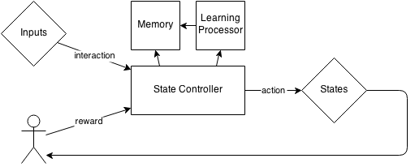
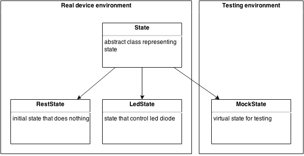
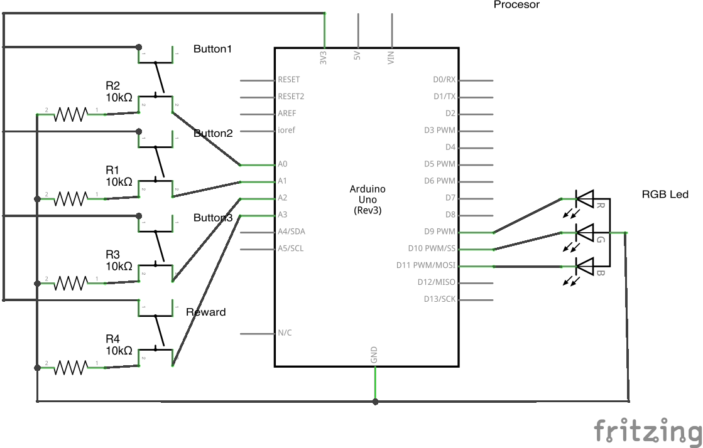
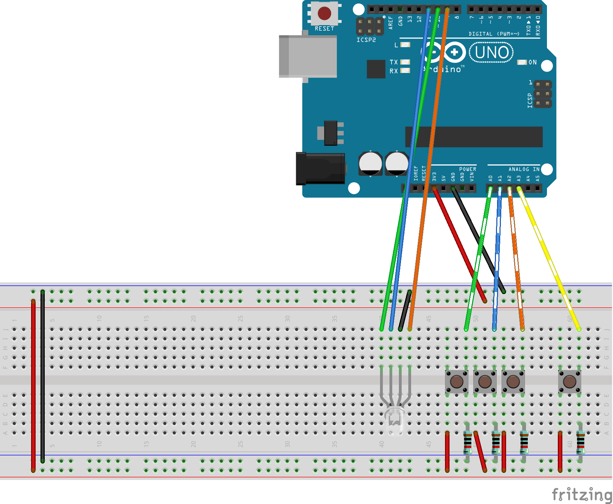

= Q-Behave
Marek Smigielski

:imagesdir: https://github.com/smigielski/q-behave/raw/master

+Q-Behave+ is machine learning library written in C++ compatible with Arduino and other embeded devices. 
The idea behind machine learning is to allow your device to acquire patterns based on user interactions. This is achieved without the need to program them beforehand. 

To illustrate this concept take RGB diode with only one button as an example. After pressing the button the user expects to see diode flash with some color. Next user will have different color in mind when pressing the button. In a conventional way the system cannot be programmed to guess user intention on which color to show.

When we put Q-Behave as a processor between interaction (pressing a button)
and state (flashing the diode) the device will choose one of possible states based on prior experience gained from user interaction. So when the user expects to see green light and instead the led flashes a different color, the user presses the button immediately again to finally get the desired color. This way the user informs the processor that he/she was expecting a different state of the diode. After several trials the device responds with a correct color right the first time because it learns what the user expects from it. 

Utilizing this technique one program can behave differently and adapt to different users. In fact the same rule applies when user changes his mind thus forcing the device 
to learn the new behaviour. After some trials with the old color the program will adapt to new rules and satisfy user expectations without the need to reprogram it.

== System design

To understand better what is this system take a look at block diagram of Q-Behave system.

[[img-block]]
.Q-Behave block diagram
  

+Inputs+ represents anything that can interact with the system like for example buttons or timers. It goes into the +State Controller+ which checks the memory and ask +Learning Processor+ to calculate the best action. As an outcome of this process an action changes the +State+ of the machine. Reward or penalty is calculated either when triggered from external interaction or timer or as a result of repetition of the same action.    

In Arduino code interaction is just an invocation of the function with the integer parameter representing the input type. States of the system are a bit more complicated, as each state have to be encalupsated as an object of class extending the abstract State class defined in the system. What is already provided can be represented by the folowing figure: 

[[img-state]]
.Q-Behave state types
  

The only thing that might need additional explanation is the testing environment and a special class +MockState+. The purpose of those two thing is to provide simple solution for testing the behaviour algorithm without the need of conneting any physical device.

== Download and Install
To download this library using git:

[source,bash]
----
git clone git@github.com:smigielski/q-behave.git
----

or

[source,bash]
----
git clone https://github.com/smigielski/q-behave.git
----

To install, copy libraries/q-behave to your Arduino/libraries/ directory. No other tasks are required and you have library ready to be used. Check example projects for details.  

== Examples

=== RGB Diode control with one button only

First example 

[[img-Q_Behave_RGB_Led_schem]]
.Schematics of RGB Diode control with one button only
image::./libraries/q_behave/examples/Q_Behave_Single_Button/Q_Behave_Single_Button_bb.png[width="700"]  

[[img-Q_Behave_RGB_Led_bb]]
.Breadboard of RGB Diode control with one button only
image::./libraries/q_behave/examples/Q_Behave_Single_Button/Q_Behave_Single_Button_schem.png[width="700"]  

=== RGB Diode with three buttons and a special reward button

[[img-Q_Behave_RGB_Led_schem]]
.Schematics of RGB Diode with three buttons and a special reward button
  

[[img-Q_Behave_RGB_Led_bb]]
.Breadboard of RGB Diode with three buttons and a special reward button
  

Using this library is very simple. In fact even six year old girl had no problems 
teaching Arduino how to distinguish colors. Watch https://vimeo.com/92062034[this video] to see full learning process:
 
https://vimeo.com/92062034

In this process we had three buttons and RGB diode. No mixing of colors was used so this 
setup acts as three seperate diodes. 
The aim of the teacher was to pick one color and assign it to the button on the breadboard. 
Whenever Arduino shows correct color after pushing the button, the teacher accepts it 
by pressing the reward button.

As shown in this video, learning time is very short. 60 second to learn a basic pattern with acceptable
level of success was enough.   

== Starting up

=== Hardware

=== Libraries

== License

This work is licensed as GPL software. See LICENSE file for full text. If you need other license or would like to get support, please contact us.
